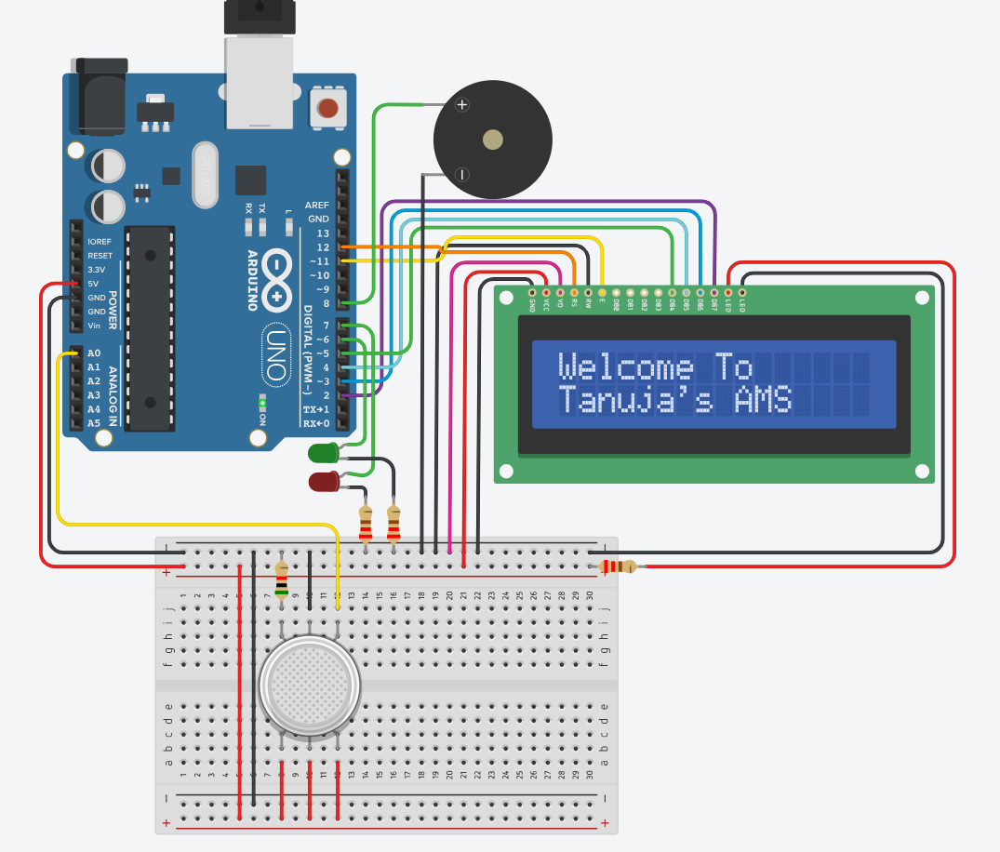
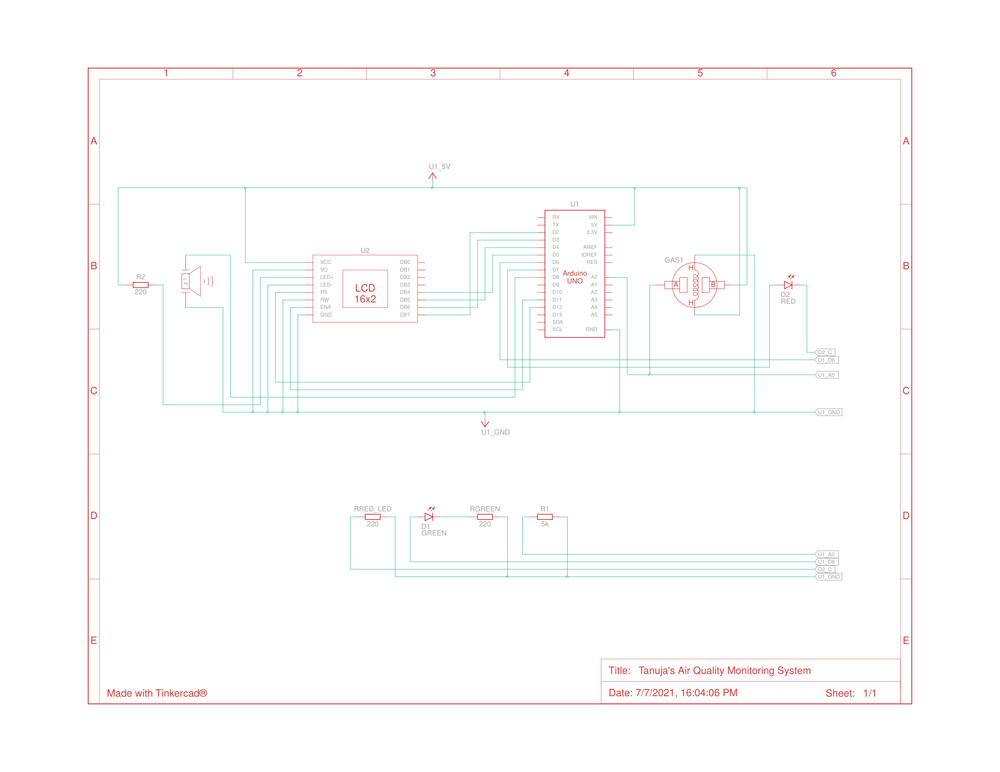
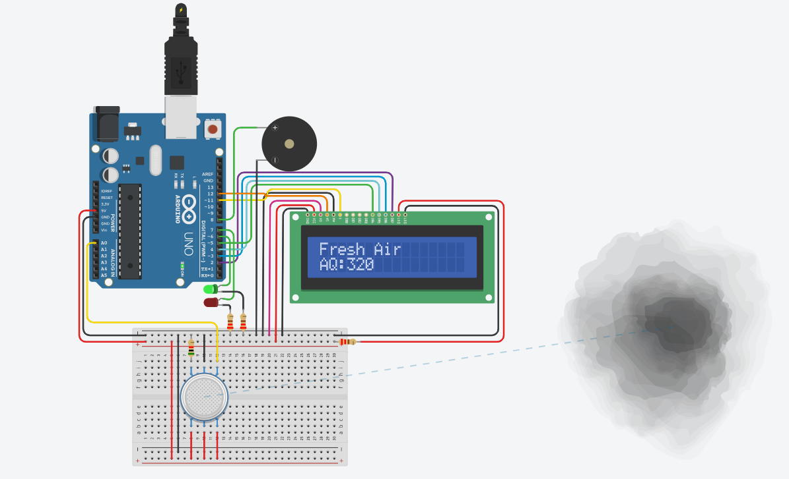
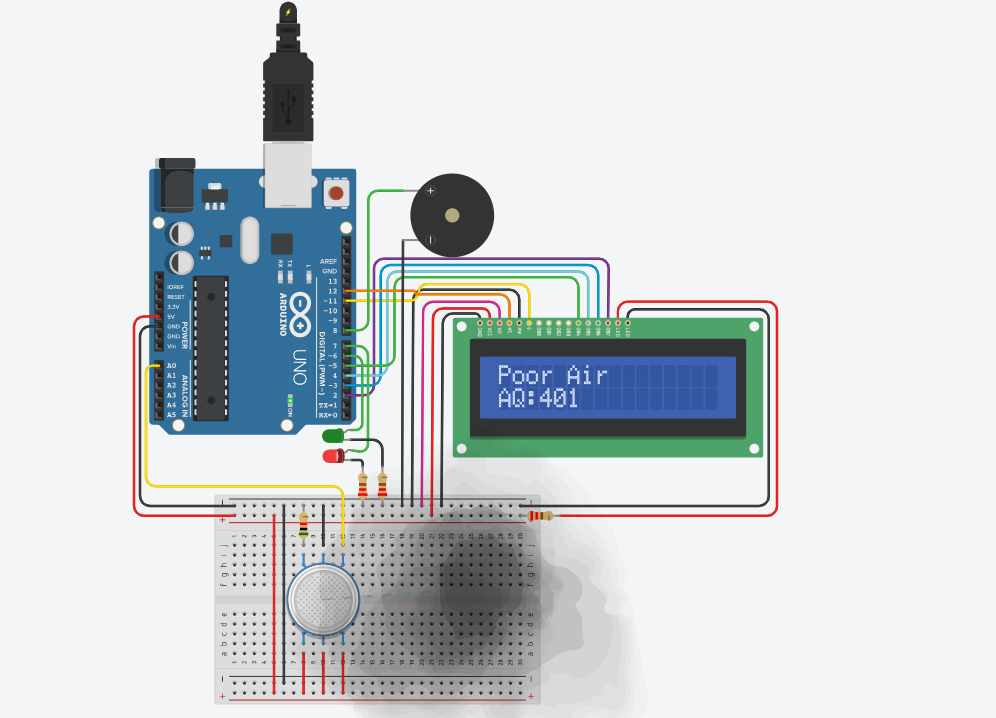
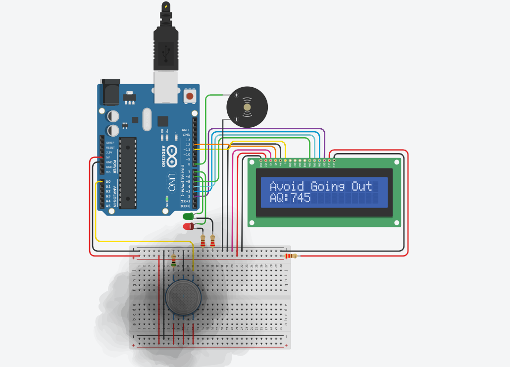

# Air Quality Monitoring System using IoT

This project presents an **IoT-Based Air Quality Monitoring System** designed to monitor surrounding air quality in real time using an MQ gas sensor and an Arduino Uno. The system classifies air quality into three levels — **Fresh Air, Poor Air, and Very Poor Air** — and provides alerts through LEDs, a buzzer, and a 16×2 LCD display.

## Overview

Air pollution is one of the major environmental concerns affecting human health and quality of life. This project was developed as an internship report and practical implementation to demonstrate how embedded systems and IoT concepts can be used for real-time environmental monitoring in a simple and cost-effective way.

The system continuously reads gas concentration values from the MQ sensor, processes them using Arduino Uno, and displays the air quality status on an LCD screen. It also provides visual and audible alerts whenever the air quality becomes unsafe.

## Objectives

- To design and develop a low-cost air quality monitoring system using Arduino Uno.
- To measure harmful gas concentration using an MQ gas sensor.
- To classify air quality into Fresh Air, Poor Air, and Very Poor Air categories.
- To display air quality status and sensor readings on a 16×2 LCD.
- To provide visual indication using LEDs.
- To generate an audible alert using a buzzer when air becomes hazardous.
- To demonstrate the application of IoT and embedded systems in environmental monitoring.

## Components Used

- Arduino Uno
- MQ Gas Sensor
- 16×2 LCD Display
- Green LED
- Red LED
- Buzzer
- Connecting wires and basic supporting components

## Working Principle

The MQ gas sensor detects the concentration of gases in the surrounding atmosphere and sends analog values to the Arduino Uno. Based on predefined threshold values, the Arduino classifies the air quality into one of three categories.

- **Fresh Air**: Green LED turns ON, Red LED remains OFF, buzzer remains OFF, and LCD shows fresh air status.
- **Poor Air**: Red LED turns ON, Green LED remains OFF, buzzer remains OFF, and LCD shows poor air status.
- **Very Poor Air**: Red LED stays ON, buzzer turns ON, and LCD displays a warning message such as “Avoid Going Out”.

## Features

- Real-time air quality monitoring.
- Low-cost and simple implementation.
- LCD-based live status display.
- Visual indication through LEDs.
- Audible warning using buzzer.
- Suitable for educational and small-scale monitoring applications.

## Applications

- Indoor air quality monitoring in homes and apartments.
- Monitoring in schools, colleges, and universities.
- Offices and commercial buildings.
- Industrial and factory environments.
- Laboratories with harmful gases.
- Research and educational IoT projects.

## Limitations

- The MQ sensor provides relative gas concentration values and not exact pollutant measurement in PPM.
- The system does not distinguish between different gas types.
- Sensor readings may vary depending on temperature, humidity, and calibration.
- The current validation was done through Tinkercad simulation.

## Project Structure

```text
air-quality-monitoring-system-iot/
├── images/
│   ├── block-diagram.png
│   ├── fresh-air.png
│   ├── poor-air.png
│   ├── very-poor-air.png
│   └── schematic-view.png
├── report/
│   └── internship-report.pdf
├── src/
│   ├── arduino/
│   │   └── air_quality_monitoring_system_code.ino
│   └── simulation/
│       └── air_quality_monitoring_system_circuit.brd
└── LICENSE
```

## Repository Contents

### Images
Project diagrams and simulation output screenshots:

- [Block Diagram](./images/block-diagram.png)
- [Fresh Air Output](./images/fresh-air.png)
- [Poor Air Output](./images/poor-air.png)
- [Very Poor Air Output](./images/very-poor-air.png)
- [Schematic View](./images/schematic-view.png)

### Report
- [Internship Report PDF](./report/internship-report.pdf)

### Source Code
- [Arduino Code](./src/arduino/air_quality_monitoring_system_code.ino)
- [Simulation Circuit File](./src/simulation/air_quality_monitoring_system_circuit.brd)

## Tinkercad Simulation

The project simulation can be viewed here:

[View Tinkercad Simulation](https://www.tinkercad.com/things/gDjhMcdmYHk-tanujas-air-quality-monitoring-system)

## Output Screens

### Block Diagram


### Schematic View


### Fresh Air Output


### Poor Air Output


### Very Poor Air Output


## Future Scope

- Integration with Wi-Fi or GSM modules for remote monitoring.
- Uploading sensor data to cloud platforms for real-time analysis.
- Development of a mobile application for live monitoring and alerts.
- Addition of temperature and humidity sensors.
- Use of advanced sensors for improved measurement accuracy.
- Deployment in smart city monitoring systems.

## Author

**[Tanuja Dasari](https://www.linkedin.com/in/tanuja-dasari/)**  |  B.Tech in Electronics and Communication Engineering  |  GITAM Institute of Technology

## License

This project is licensed under the MIT License. See the [LICENSE](./LICENSE) file for details.
